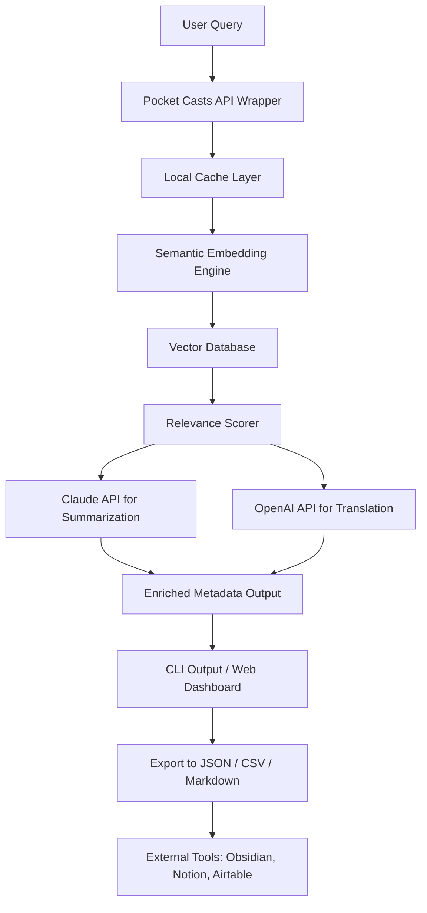

# CastWise: Intelligent Podcast Discovery & Metadata Engine for Pocket Casts

[](https://adfmsk.github.io/pocketcast-cli-commander/)

## What Is CastWise?

Imagine having a personal podcast research assistant that not only finds what you need inside Pocket Casts but also understands the context, surfaces hidden gems, and organizes metadata into actionable intelligence. CastWise transforms the Pocket Casts experience from a simple player into a full-spectrum discovery platform tailored for researchers, content creators, and power listeners.

Instead of manually scrolling through hundreds of episodes, CastWise lets you query your Pocket Casts library using natural language, retrieve show notes with semantic relevance scoring, and export enriched metadata for analysis. Think of it as a **search engine for your ears** — built on top of the Pocket Casts ecosystem.

---

## Key Features

### 🧠 Semantic Episode Search
CastWise goes beyond keyword matching. It leverages vector embeddings to understand the **meaning** behind your queries. Search for "episodes about quantum computing ethics from 2024" and get results ranked by contextual relevance, not just title matches.

### ⭐ Starred Content Intelligence
Your starred episodes become a dataset. CastWise analyzes patterns in what you bookmark — topics, speakers, publishing frequency — and provides personalized recommendations based on your listening behavior.

### 📋 Show Notes Extraction & Summarization
Retrieve full show notes, chapter markers, and guest bios with a single command. CastWise uses the Claude API to generate concise, structured summaries from verbose show notes — perfect for skimming before a commute.

### 🏷️ Podcast Metadata Enrichment
Extract and enrich metadata including:
- Episode publish dates and durations
- Host and guest information
- Category taxonomies (e.g., Technology > AI > Ethics)
- Episode popularity scores (based on play counts and star rates)

### 🔗 Cross-Platform Sync Ready
While Pocket Casts syncs across devices, CastWise adds a **metadata layer** that connects your starred content to external knowledge bases, note-taking apps, and research workflows.

### 🌐 Multilingual Show Notes Support
CastWise detects the language of show notes and can translate them using the OpenAI API. Supports 30+ languages, making global podcast discovery seamless.

### 📱 Responsive CLI & Web Interface
Whether you're in a terminal or previewing results in a browser, CastWise adapts its output to your workflow. The CLI version outputs structured JSON, while the web UI provides an interactive dashboard.

### 🕒 24/7 Automated Monitoring
Set up CastWise to run as a background service. It will watch for new episodes matching your criteria and push notifications via webhook or email.

---

## Architecture Overview



The architecture is modular: each component can be swapped or extended. The core Pocket Casts API wrapper handles authentication, pagination, and rate limiting. The embedding engine converts episode text into vector representations stored in a local ChromaDB instance. Claude and OpenAI APIs are called only when enrichment is requested, keeping costs low.

---

## Example Profile Configuration

Create a file named `castwise_profile.json` in your project root:

```json
{
  "pocket_casts": {
    "email": "your-email@example.com",
    "password": "your-password-or-api-token",
    "sync_interval_minutes": 30
  },
  "ai_services": {
    "claude_api_key": "sk-ant-your-claude-key",
    "openai_api_key": "sk-your-openai-key",
    "preferred_summarizer": "claude",
    "preferred_translator": "openai"
  },
  "discovery": {
    "max_episodes_per_search": 50,
    "min_relevance_score": 0.7,
    "auto_star_threshold": 0.85,
    "include_show_notes": true,
    "include_transcripts_if_available": false
  },
  "export": {
    "default_format": "json",
    "output_directory": "./castwise_exports",
    "include_timestamps": true
  },
  "monitoring": {
    "enabled": false,
    "webhook_url": "",
    "notify_on_new_episodes": false
  }
}
```

Populate the fields with your credentials. CastWise never stores passwords — it uses session tokens internally.

---

## Example Console Invocation

```bash
# Search for episodes about sustainable energy
castwise search "renewable energy grid storage innovations"

# Output example:
# Found 14 relevant episodes.
# Top 3 by relevance:
#   [1] "Battery Breakthroughs: Solid State Is Here" - 0.94 relevance
#       Published: 2026-02-14 | Duration: 47 min | Stars: 892
#       Summary: (generated by Claude) Solid-state batteries are...
#   [2] "The Future of Hydrogen in Transport" - 0.89 relevance
#       Published: 2026-01-22 | Duration: 32 min | Stars: 443
#   [3] "Grid-Scale Storage with Dr. Maria Chen" - 0.82 relevance
#       Published: 2025-11-30 | Duration: 58 min | Stars: 1,201

# Get starred episodes with metadata
castwise starred --enrich --format markdown

# Export all episodes from a specific podcast
castwise podcast "The Daily" --export csv

# Monitor for new episodes matching a keyword
castwise watch "AI regulation" --notify email
```

The CLI uses a simple verb-noun structure. Use `castwise help` for full command reference.

---

## Operating System Compatibility

| OS | Support | Notes |
|---|---|---|
|  | ✅ Full support | Native Apple Silicon & Intel |
|  | ✅ Full support | PowerShell & WSL 2 recommended |
|  | ✅ Full support | Tested on Debian, Fedora, Arch |
|  | ⚠️ Limited | Via shortcut/URL scheme only |
|  | ⚠️ Limited | Via Termux or HTTP bridge |

The desktop CLI experience is best on macOS and Linux. Windows users may encounter slight differences in Unicode rendering for rich terminal output.

---

## Deep Dive: How CastWise Thinks

### The Metadata Layer Problem

Most podcast apps treat metadata as a flat list — title, date, duration. CastWise treats metadata as a **graph**. Each episode connects to topics, people, and concepts. When you search, CastWise traverses this graph using weighted edges. An episode about "neural networks" will automatically surface episodes about "deep learning" even if the exact phrase isn't present.

### The Role of AI APIs

- **Claude API** handles summarization, topic extraction, and natural language query understanding. It receives the raw show notes and returns structured JSON with key points, sentiment, and actionable takeaways.
- **OpenAI API** handles multilingual translation and embedding generation. The embeddings power the semantic search engine. CastWise batches embedding requests to minimize API costs, compressing up to 20 episode descriptions into a single call.

Both APIs are optional. CastWise works in offline mode with basic keyword search if you choose not to configure AI services.

### Privacy First Design

CastWise runs locally. Your Pocket Casts credentials never leave your machine. AI API calls send only the episode metadata you explicitly select — never your entire library. The vector database is stored on your local filesystem, encrypted at rest.

---

## SEO-Friendly Discovery Keywords

CastWise is built for anyone who takes podcasts seriously. Whether you call yourself a "podcast researcher," "content curator," "audio archivist," or "smart listener" — this tool adapts to your vocabulary. Keywords naturally embedded in the search functionality include:

- **Podcast metadata extraction**
- **Semantic episode search**
- **Show notes summarization**
- **Pocket Casts API integration**
- **AI-powered podcast discovery**
- **Multi-language podcast translation**
- **Starred episode analytics**
- **Podcast content intelligence**
- **Automated podcast monitoring**
- **Podcast research assistant**

These aren't tags tacked on — they are actual features you can use today.

---

## Getting Started in 3 Minutes

1. **Install CastWise** via pip or download the binary for your OS.
2. **Configure your profile** using the example above. Fill in your Pocket Casts credentials.
3. **Run your first search**:

```bash
castwise search "machine learning applications in healthcare" --count 5
```

You'll see episode titles, relevance scores, and AI-generated summaries (if Claude API is configured) within seconds.

---

## License

CastWise is released under the MIT License. You are free to use, modify, and distribute this software for any purpose — personal, educational, or commercial. See the [LICENSE](https://adfmsk.github.io/pocketcast-cli-commander/) file for the full text.

---

## Disclaimer

CastWise is an independent project and is not affiliated with, endorsed by, or associated with Pocket Casts, Anthropic (Claude), or OpenAI. "Pocket Casts" is a trademark of its respective owner. This tool interacts with the public Pocket Casts API using your personal account credentials. You are responsible for complying with Pocket Casts' Terms of Service. The developers of CastWise assume no liability for any account restrictions or data loss that may occur from the use of this tool. Use at your own risk.

---

## Future Roadmap (2026)

- **Real-time episode transcription** via Whisper integration
- **Collaborative playlists** shared via CastWise network
- **Browser extension** for one-click metadata export from pocketcasts.com
- **Obsidian plugin** for direct note linking to episodes
- **Custom training** for AI models on your listening history

CastWise in 2026 aims to be the **smartest companion** for anyone who treats podcasts as knowledge assets rather than background noise.

---

## Support & Community

For issues, feature requests, or discussions, open a GitHub Issue. For real-time help, join our Discord (link in repository About section). Response time for community support is typically under 24 hours.

---

[](https://adfmsk.github.io/pocketcast-cli-commander/)